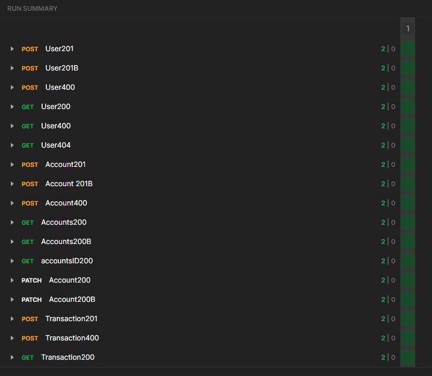
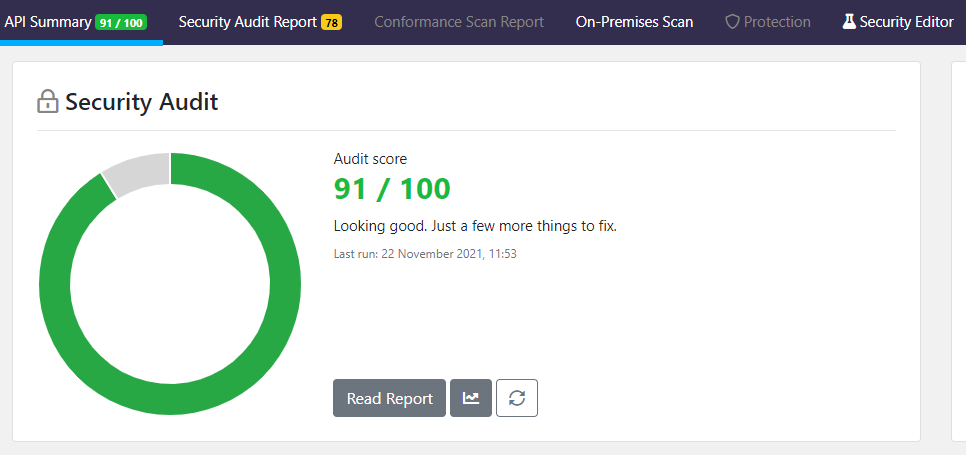
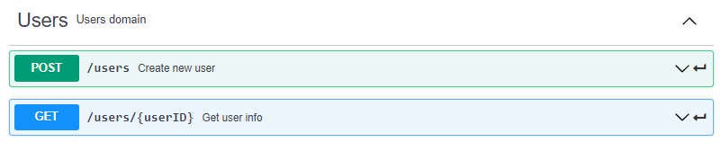
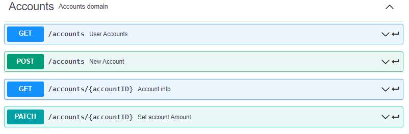
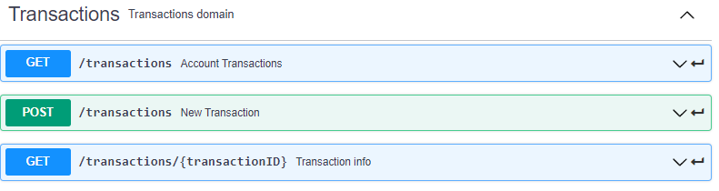

# poc-iobuilders
<!-- @import "[TOC]" {cmd="toc" depthFrom=2 depthTo=5 orderedList=false} -->
<!-- code_chunk_output -->

- [poc-iobuilders](#poc-iobuilders)
  - [Control de cambios](#control-de-cambios)
  - [Necesidades](#necesidades)
  - [Descripción](#descripción)
  - [Instalación](#instalación)
  - [Desarrollo](#desarrollo)
    - [Dominio-Entidad](#dominio-entidad)
      - [User](#user)
      - [Account](#account)
      - [Transaction](#transaction)
    - [Servicio-Lógica de Negocio](#servicio-lógica-de-negocio)
      - [UserService](#userservice)
      - [Account Service](#account-service)
      - [Transaction Service](#transaction-service)
    - [Adapter Rest](#adapter-rest)
      - [User Rest Adapter](#user-rest-adapter)
      - [Account Rest Adapter](#account-rest-adapter)
      - [TransactionRest Adapter](#transactionrest-adapter)
  - [Testing](#testing)
    - [Test Unitarios](#test-unitarios)
    - [Test Aceptación](#test-aceptación)
  - [Trazabilidad](#trazabilidad)
  - [Contrato-API REST](#contrato-api-rest)
    - [Users API](#users-api)
    - [Accounts API](#accounts-api)
    - [Transactions API](#transactions-api)
  - [Gestor de Dependencias](#gestor-de-dependencias)
    - [Artefacto](#artefacto)
    - [Propiedades](#propiedades)
    - [Dependencias](#dependencias)
      - [spring-boot-starter-web](#spring-boot-starter-web)
      - [spring-boot-starter-data-jpa](#spring-boot-starter-data-jpa)
      - [spring-cloud-starter-sleuth](#spring-cloud-starter-sleuth)
      - [h2](#h2)
      - [spring-boot-starter-test](#spring-boot-starter-test)
      - [springfox-swagger2](#springfox-swagger2)
      - [springfox-swagger-ui](#springfox-swagger-ui)
      - [spring-boot-starter-actuator](#spring-boot-starter-actuator)
      - [org.iban4j](#orgiban4j)
    - [Build](#build)
  - [TODO](#todo)
    - [Seguridad](#seguridad)
 <!-- /code_chunk_output -->

## Control de cambios

| Fecha      | Versión | Estado | Modificado               |
| :--------- | :------ | :----- | :----------------------- |
| 22/11/2021 | 1.0.1   | OK     | pedrodlafuente@gmail.com |
| 23/11/2021 | 1.0.16   | OK     | pedrodlafuente@gmail.com |

## Necesidades

API Rest para simular un pequeño banco:

- Registro usuario
- Creación de cuenta (wallet)
- Realización de depósito de dinero
- Visualización de cuenta (wallet) --> Balance y movimientos
- Transferencia de una cuenta A a una cuenta B

Puntos a destacar:

- Arquitectura Hexagonal y testing (Obligatorio).
- Libertad en el stack usado en la prueba, aunque preferiblemente algún lenguaje de la JVM, Java, Groovy o haciendo uso de Spring, Micronaut o Quarkus.

## Descripción

Finalmente he optado por un micro con **Spring-boot** por afinidad con el framework. El micro contiene los tres dominios funcionales *Users*,*Accounts*,*Transactions*.

## Instalación

El proyecto está pensado para ser ejecutado con un build de **Maven**, contiene una serie de depencias (explicadas en los siguientes puntos) que hacen imprescindible el uso de ciertos plugins.

Para ejecutar el proyecto con el terminal en la raiz del mismo, lanzaremos el siguiente comando:

> mvn clean install spring-boot:run

Hecho esto, el swagger del proyecto debería ser accesible vía navegador en <http://localhost:8080/swagger-ui.html#/>

## Desarrollo

El proyecto está pensado para exponer los servicios via REST. No obstante, el planteamiento de la aplicación en cuanto a su construcción, está desarrollado para poder añadir otros adaptadores si fuera necesario. Este desacoplamiento entre servicios de dominio viene dado por uno de los requisitos de la POC que era su desarrollo en base a una Arquitectura Hexagonal y el uso de DDD. Todo esto sin olvidarnos de los principios de API-First y las buenas prácticas de desarrollo de Micro Servicios.

Para lograr una aproximación a una arquitectura Hexagonal, he planteado de dentro a fuera las siguientes capas:

### Dominio-Entidad

Se plantean tres Entidades :

#### User

```` java
    @Id
    @Column(name = "id")
    private UUID id;
    @Column(name = "name")
    private String name;
    @Column(name ="surname")
    private String surname;
    @Column(name = "mail")
    private String mail;
    @Column(name = "pass")
    private String pass;

````

#### Account

```` java
    @Id
    @Column(name = "id")
    private UUID id;
    @Column(name = "userId")
    private UUID userID;
    @Column(name = "amount")
    private BigDecimal amount;
    @Column (name = "iban",unique=true)
    private String iban;
````

#### Transaction

```` java
    @Id
    @Column(name = "id")
    private UUID transactionID;
    @Column(name = "amount")
    private BigDecimal amount;
    @Column(name = "beneficiaryIBAN")
    private String beneficiaryIBAN;
    @Column(name = "issuerIBAN")
    private String issuerIBAN;
    @Column(name = "date")
    private Date date;
````

### Servicio-Lógica de Negocio

#### UserService

```` java
@Service
public class UserService {

    public UserResponse createUser(UserRequest userRequest){}

    public UserResponse getUserById(UUID userId){}
    
    public boolean isPresent(UUID userId) {}

}
````

#### Account Service

```` java
@Service
public class AccountService {

 public AccountResponse createAccount(AccountRequest accountRequest) {}
 
 public AccountResponse addAmount(UUID accountID, BigDecimal amount){}

 public AccountResponse subtractAmount(UUID accountID, BigDecimal amount){}
 
 public Accounts getAccountsByUser(UUID userID) {}
 
 public AccountResponse getAccount(UUID accountID) {}

 public Optional<Account> getOptionalAccountByIBAN(String iban) {}
 
}
````

#### Transaction Service

```` java
@Service
public class TransactionService {

 public TransactionResponse createTransaction(TransactionRequest transactionRequest) {}

 public TransactionResponse getTransactionById(UUID transactionId) {}

 public Transactions getTransactionsByAccount(String iban) {}

 private List<Transaction> transactionListParser(List<Transaction> list, String Iban) {}
 
}
````

### Adapter Rest

#### User Rest Adapter

```` java
@Component
public class UserAdapter {

    private UserService userService;

    public UserAdapter(UserService userService){}

    public UserResponse createUser(UserRequest userRequest){}

    public UserResponse getUserById(UUID userId){}
    
}
````

#### Account Rest Adapter

```` java
@Component
public class AccountAdapter {

 
 public AccountResponse getAccountByID(UUID accountID) {}
 
 public AccountResponse createAccount(AccountRequest acountRequest) {}
 
 public Accounts getAccountsByUser(UUID userID) {}
 
 public AccountResponse addAmount(UUID accountID, BigDecimal amount) {}
 
 public AccountResponse subtractAmount(UUID accountID, BigDecimal amount) {}
 
 public Optional<Account> getOptionalAccountByIBAN(String iban) {}

}
````

#### TransactionRest Adapter

```` java
@Component
public class TransactionAdapter {
    
    public TransactionAdapter(TransactionService transactionService){}

    public TransactionResponse createTransaction(TransactionRequest transactionRequest){}

    public TransactionResponse getTransactionById(UUID transactionId){}

    public Transactions getTransactionsByAccount(String iban){}

}
````

## Testing

### Test Unitarios

Los test unitarios que se han realizado dan covertura solo el dominio de **User**, aunque soy conciente que no es lo correcto , entiendo que dan una visión del uso de los mismos.  

### Test Aceptación

Para simular los test de acceptación he se ha creado una [coleción](https://github.com/pedrodlf/poc-iobuilders/blob/main/src/test/java/resources/iobuilders.postman_collection.json) de Postman que junto con el [enviromen](https://github.com/pedrodlf/poc-iobuilders/blob/main/src/test/java/resources/iobuilders.postman_environment.json) permite lanzar un flujo completo de pruebas.
Una vez instalada la coleción en Postman y selecionadas las variables de entorno facilitadas, selecionaremos la opción de **RUN COLLECTION** en Postman para obtener  un resultado como el siguiente:



>Se podria profundizar mas en los tipos de respuesta no obstante, dado el alcance de la prueba he estimado que estos ya  ofrecen una visión general de la funcionalidad del servicio.

## Trazabilidad

En Java el proyecto Spring Cloud Sleuth proporciona la funcionalidad de trazabilidad. En el esquema se observa como Sleuth envía las cabeceras de un servicio cliente a un servicio servidor.

````
   Client Span                                                Server Span
┌──────────────────┐                                       ┌──────────────────┐
│                  │                                       │                  │
│   TraceContext   │           Http Request Headers        │   TraceContext   │
│ ┌──────────────┐ │          ┌───────────────────┐        │ ┌──────────────┐ │
│ │ TraceId      │ │          │ X─B3─TraceId      │        │ │ TraceId      │ │
│ │              │ │          │                   │        │ │              │ │
│ │ ParentSpanId │ │ Extract  │ X─B3─ParentSpanId │ Inject │ │ ParentSpanId │ │
│ │              ├─┼─────────>│                   ├────────┼>│              │ │
│ │ SpanId       │ │          │ X─B3─SpanId       │        │ │ SpanId       │ │
│ │              │ │          │                   │        │ │              │ │
│ │ Sampled      │ │          │ X─B3─Sampled      │        │ │ Sampled      │ │
│ └──────────────┘ │          └───────────────────┘        │ └──────────────┘ │
│                  │                                       │                  │
└──────────────────┘                                       └──────────────────┘
````

Tal y como podemos ver en la siguiente traza, Sleuth se encarga de mantener la traza y propagarla. En un ecosistema de Spring Cloud se podria añadir un servidor Zipkin que permite registrar los pares trace-span que van generando los microservicios con la librería Spring Cloud Sleuth. Además nos provee de una interfaz para realizar búsquedas de las peticiones de nuestro sistema.

````
2021-11-23 03:21:19.664  INFO [iobuilders-bank,49510043c31cb9cd,49510043c31cb9cd] 18896 --- [nio-8080-exec-2] c.p.i.b.u.a.rest.UserControllerImpl      : usersPost mail@mail1.com
2021-11-23 03:21:19.803  INFO [iobuilders-bank,c9b82ba3f3562877,c9b82ba3f3562877] 18896 --- [nio-8080-exec-3] c.p.i.b.u.a.rest.UserControllerImpl      : usersPost mail2@mail2.com
2021-11-23 03:21:19.896  INFO [iobuilders-bank,dd9a94580ccb3306,dd9a94580ccb3306] 18896 --- [nio-8080-exec-4] c.p.i.b.u.a.rest.UserControllerImpl      : usersPost mail@mail1.com
2021-11-23 03:21:19.899  WARN [iobuilders-bank,dd9a94580ccb3306,dd9a94580ccb3306] 18896 --- [nio-8080-exec-4] o.h.engine.jdbc.spi.SqlExceptionHelper   : SQL Error: 23505, SQLState: 23505
2021-11-23 03:21:19.900 ERROR [iobuilders-bank,dd9a94580ccb3306,dd9a94580ccb3306] 18896 --- [nio-8080-exec-4] o.h.engine.jdbc.spi.SqlExceptionHelper   : Violación de indice de Unicidad ó Clave primaria:
````

## Contrato-API REST

Para la capa REST he definido un Swagger2.0 que contiene los tres [contratos](https://github.com/pedrodlf/poc-iobuilders/blob/main/src/main/resources/generador_1.0.1.yaml), para su validación he empleado [herramientas](https://42crunch.com/) de control de calidad de APIs basadas en la normativa definida por  *OWASP Top 10 for API Security*. Con el siguiente resultado:



### Users API



### Accounts API



### Transactions API



## Gestor de Dependencias

El gestor de dependecias usado es **Maven** , con la siguiente configuración:

### Artefacto

```` xml
<groupId>com.pedrodlf</groupId>
<artifactId>iobuilders</artifactId>
<version>0.0.1-SNAPSHOT</version>
<name>iobuilders</name>
<description>POC rest</description>
````

### Propiedades

```` xml
<properties>
 <java.version>1.8</java.version>
 <project.build.sourceEncoding>UTF-8</project.build.sourceEncoding>
 <project.reporting.outputEncoding>UTF-8</project.reporting.outputEncoding>
 <springfox-version>2.7.0</springfox-version>
 <api.version>1.0.1</api.version>
</properties>
````

### Dependencias

Las principales dependencias son las siguientes:

#### spring-boot-starter-web

Spring MVC, REST y Tomcat como servidor integrado predeterminado. La dependencia única spring-boot-starter-web atrae de forma transitiva todas las dependencias relacionadas con el desarrollo web. También reduce el recuento de dependencias de compilación. Spring-boot-starter-web depende transitivamente de lo siguiente:
org.springframework.boot: spring-boot-starter
org.springframework.boot: spring-boot-starter-tomcat
org.springframework.boot: Spring-boot-starter-validation
com.fasterxml.jackson.core: jackson-databind
org.springframework: spring-web
org.springframework: spring-webmvc

```` xml
<dependency>
  <groupId>org.springframework.boot</groupId>
  <artifactId>spring-boot-starter-web</artifactId>
</dependency>
````

#### spring-boot-starter-data-jpa

Características principales de Spring Data JPA que son las siguientes:

- **Repositorio sin código**: nos permite implementar nuestro código comercial en un nivel de abstracción superior.
- **Código repetitivo reducido**: proporciona la implementación predeterminada para cada método mediante sus interfaces de repositorio; no es necesario implementar operaciones de lectura y escritura.
- **Consultas generadas**: otra característica de Spring Data JPA es la generación de consultas de base de datos basadas en el nombre del método.

```` xml
<dependency>
 <groupId>org.springframework.boot</groupId>
 <artifactId>spring-boot-starter-data-jpa</artifactId>
</dependency>
````

#### spring-cloud-starter-sleuth

Es una librería que permite identificar las peticiones de forma unívoca sobre nuestra arquitectua. Para ello sobre cada petición mantiene, entre otros, los siguientes atributos:

- **Trace**. Identificador asociado a la petición que viaja entre los microservicios
- **Span**. Identificador de la petición REST actual que se encuentra en un determinado microservicio

De esta forma podemos deducir que un trace contiene un conjunto de span

```` xml
<dependency>
   <groupId>org.springframework.cloud</groupId>
   <artifactId>spring-cloud-starter-sleuth</artifactId>
   <version>3.0.4</version>
</dependency>
````

#### h2

Las principales características de H2 son:

- API JDBC de código abierto.
- Modo integrado.
- Bases de datos en disco o en memoria.
- Bases de datos encriptadas.
- Búsqueda de texto completo.
- Java con tamaño reducido: alrededor de 2,5 MB de tamaño de archivo jar.
- Controlador ODBC.

```` xml
<dependency>
 <groupId>com.h2database</groupId>
 <artifactId>h2</artifactId>
 <scope>runtime</scope>
</dependency>
````

#### spring-boot-starter-test

Contiene la mayoría de los elementos necesarios para la realización del testing. El tag **<scope> test </scope>** permite ignorar todas las dependecias declaradas con el *scope test* cuando el servicio se empaqueta para el despliegue.

```` xml
<dependency>
 <groupId>org.springframework.boot</groupId>
 <artifactId>spring-boot-starter-test</artifactId>
 <scope>test</scope>
</dependency>
````

#### springfox-swagger2

Produce la documentación de la API Swagger 2.0 que podemos ver en <http://localhost:8080/swagger-ui.html#/> cuando el proyecto está en ejecución.

```` xml
<dependency>
 <groupId>io.springfox</groupId>
 <artifactId>springfox-swagger2</artifactId>
 <version>${springfox-version}</version>
</dependency>
````

#### springfox-swagger-ui

Crea un webjar que contiene el contenido estático de swagger-ui. Agrega un punto final JSON /swagger-resourcesque, enumera todos los recursos y versiones de swagger configurados para una aplicación determinada. La página de la interfaz de usuario de Swagger debería estar disponible en  <http://localhost:8080/swagger-ui.html#/>

```` xml
<dependency>
 <groupId>io.springfox</groupId>
 <artifactId>springfox-swagger-ui</artifactId>
 <version>${springfox-version}</version>
</dependency>
````

#### spring-boot-starter-actuator

Nos ayudará a monitorizar y gestionar nuestra aplicación. Podemos usar tanto HTTP como JMX para gestionar y monitorizar la aplicación.
Simplemente añadiendo el starter que nos ofrece Spring Boot tendremos una serie de características en nuestra aplicación sobre su ejecución.

```` xml
<dependency>
 <groupId>org.springframework.boot</groupId>
 <artifactId>spring-boot-starter-actuator</artifactId>
</dependency>
````

#### org.iban4j

Nos permite generar IBAN Randomizados pero que cumples con los estándares españoles para la POC.

```` xml
<dependency>
 <groupId>org.iban4j</groupId>
 <artifactId>iban4j</artifactId>
 <version>3.2.3-RELEASE</version>
</dependency>
````

### Build

Esta build de maven es la que nos permite realizar la generación automática de los contratos de los controladores y los DTO a partir de la definicion en **Swagger2.0**. Es por eso que, al menos la primera vez que se ejecute el proyecto, es imprescindible su construcción con **Maven**. En mi caso, he tenido que configurar el plugin de eclipse para que funcione correctamente.

```` xml
<build>
  <sourceDirectory>src/main/java</sourceDirectory>
  <resources>
   <resource>
    <directory>${project.build.sourceDirectory}/../resources</directory>
   </resource>
   <resource>
    <directory>${project.build.directory}/generated-sources/swagger/src/main/resources</directory>
   </resource>
  </resources>
  <plugins>

   <plugin>
    <groupId>org.springframework.boot</groupId>
    <artifactId>spring-boot-maven-plugin</artifactId>
    <executions>
     <execution>
      <goals>
       <goal>repackage</goal>
      </goals>
     </execution>
    </executions>
   </plugin>
   <plugin>
    <groupId>org.apache.maven.plugins</groupId>
    <artifactId>maven-surefire-plugin</artifactId>
   </plugin>
   <plugin>
    <groupId>io.swagger</groupId>
    <artifactId>swagger-codegen-maven-plugin</artifactId>
    <version>2.2.3</version>
    <executions>
     <execution>
      <id>generate-spring-mvc</id>
      <goals>
       <goal>generate</goal>
      </goals>
      <configuration>

       <inputSpec>${project.build.sourceDirectory}/../resources/generador_${api.version}.yaml</inputSpec>
       <language>spring</language>
       <modelPackage>com.pedrodlf.iobuilders.model</modelPackage>
       <apiPackage>com.pedrodlf.iobuilders.api</apiPackage>
       <configOptions>
        <interfaceOnly>true</interfaceOnly>
        <dateLibrary>java.util.Date</dateLibrary>

       </configOptions>
      </configuration>
     </execution>
    </executions>
   </plugin>
   <plugin>
    <groupId>org.codehaus.mojo</groupId>
    <artifactId>build-helper-maven-plugin</artifactId>
    <executions>
     <execution>
      <id>add-source</id>
      <phase>generate-sources</phase>
      <goals>
       <goal>add-source</goal>
      </goals>
      <configuration>
       <sources>
        <source>target/generated-sources/swagger/src/main/java/</source>
       </sources>
      </configuration>
     </execution>
    </executions>
   </plugin>
  </plugins>
  <pluginManagement>
   <plugins>
    <!--This plugin's configuration is used to store Eclipse m2e settings
     only. It has no influence on the Maven build itself. -->
    <plugin>
     <groupId>org.eclipse.m2e</groupId>
     <artifactId>lifecycle-mapping</artifactId>
     <version>1.0.0</version>
     <configuration>
      <lifecycleMappingMetadata>
       <pluginExecutions>
        <pluginExecution>
         <pluginExecutionFilter>
          <groupId>io.swagger</groupId>
          <artifactId>
           swagger-codegen-maven-plugin
          </artifactId>
          <versionRange>
           [2.2.3,)
          </versionRange>
          <goals>
           <goal>generate</goal>
          </goals>
         </pluginExecutionFilter>
         <action>
          <ignore></ignore>
         </action>
        </pluginExecution>
       </pluginExecutions>
      </lifecycleMappingMetadata>
     </configuration>
    </plugin>
   </plugins>
  </pluginManagement>
 </build>
````

## TODO

### Seguridad

Para definir correctamente la seguridad del proyecto sería necesario analizar los posibles clientes del API y el ecosistema en el que estaria desplegada. Hoy en dia existen diferentes soluciones teniendo en cuenta estas dos variables. Desde mi punto de vista la implementación de Oauth es un tema que hay que analizar minuciosamente. Si surgen dudas a este respecto podemos comentarlo en una sessión o puedo ampliar la documentación con diferentes supuestos.
